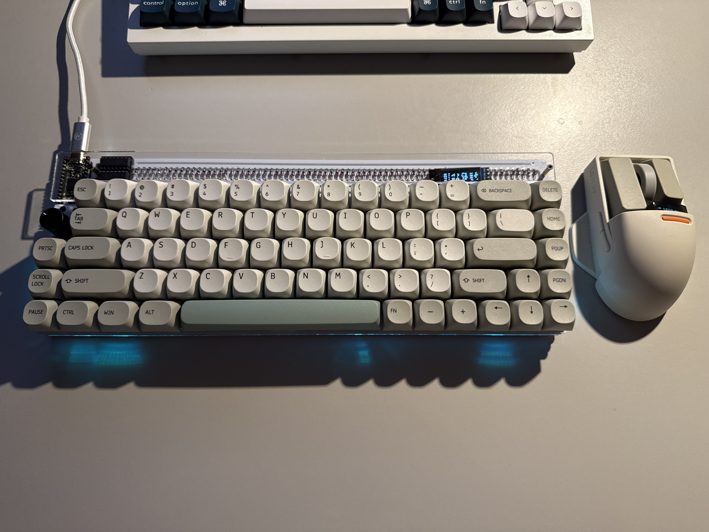
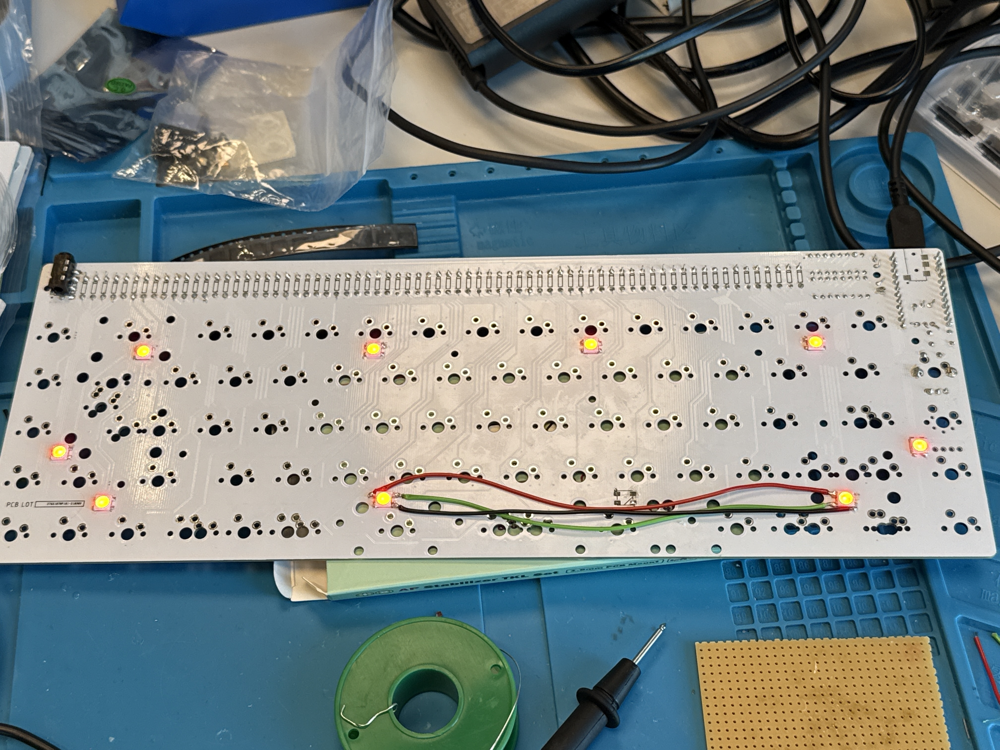
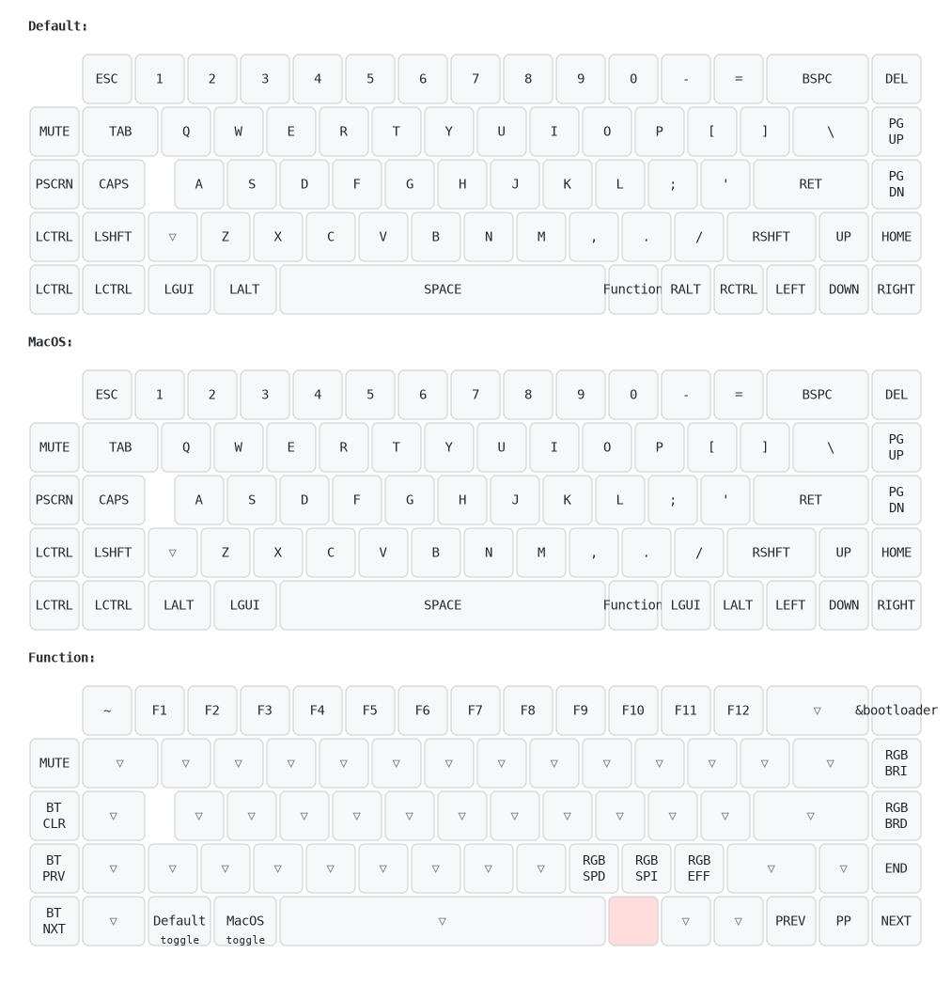

# Nibble 65

## Overview

This is my first keyboard build. For the most part it is assembled following [the instruction](https://github.com/nullbitsco/docs/blob/main/nibble/build_guide_en.md) but some of the things went off track.

The optional slots contain: 
 - a rotary encoder
 - 3 keys
 - an OLED screen (the wires are run between switches)

I also soldered a TRRS Jack for a potential extension.

For this build I chose Gateron G Pro Two-Stage Spring Silver switches and TX AP PCB Mount Screw-in stabilizers.

One of the goals of this build was to make the keyboard wireless so I went with a nicenano v2. I still need to add a battery and a power switch.

## OLED animation

The OLED UI is implemented locally in `boards/shields/nibble_oled` and does not depend on an
external display module. The upstream `nibble` shield still provides the SSD1306 hardware
definition, while `nibble_oled` owns the screen layout and animation.

The left half of the native 128x32 display shows a 64x32 cat. It remains on the idle frame until a
key press, alternates between left- and right-paw strike frames, and returns to idle 100 ms after
the latest press. Battery, output profile, active layer, and WPM are shown on the right half.

The three frames are 1-bit indexed arrays in
`boards/shields/nibble_oled/assets/bongo_cat_frames.c`. Each array starts with an eight-byte LVGL
palette followed by 256 bytes of row-major pixel data. Edit those arrays and keep all three frame
dimensions and data sizes identical when changing the artwork.

The display intentionally remains on and keyboard deep sleep is disabled. This makes the idle cat
permanently visible, but increases battery use and OLED wear.

## Setback

As you can see in the picture, I messed up one LED. While I was waiting for my stabilizers to arrive, one WS2812B LED tore off with PCB pads. I was not able to solder either the original LED or a spare one from the set, so I came up with bypassing that broken LED with wires.

If you have something similar, don't do it as I did it! I had not read all the steps before bypassing it as shown in the picture. Later, I found out that the middle acrylic spacer couldn't fit properly because of these wires, so it's better to solder the wires vertically, not horizontally as I initially did.

## Keymap

